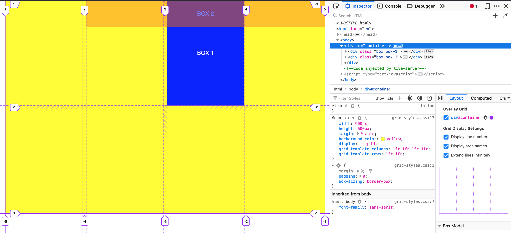

## CODING BOOTCAMP - DAY 7
[Click here to view the assessmet](https://zahinz.github.io/SET-Day-7/) | [Markdown cheatsheet](https://www.markdownguide.org/cheat-sheet/)

---

## Week-2 to-learn 💻
* var CSS
* media query
* img-size
* content width
---

## What I learned yesterday 📚
* start developing from mobile, then progress to desktop
* UX development: target audience > user avatar > user journey > design
* `@media () {}` - media query for mobile responsiveness

## Problem I solved yesterday 😎
* centering `div` using `position: absolute; left: 50%` and `transform: transitionX(-50%)`

---

## What I learned today 💡
### CSS grid
* setup grid in CSS [css tricks](https://css-tricks.com/snippets/css/complete-guide-grid/#grid-template-columnsgrid-template-rows)
* `display: grid`
* `grid-template-rows: 1fr 1fr;`
* `grid-template-columns: 1fr 1fr;`

### Intro to JS
* Data type : string, number, boolean, Array & Object
* String = text
* Number = integer, decimal, -1, 1, float
* Boolean = true / false, 1, 0
* Array & Object = to contain string, number, boolean
Variables = const, let

### DOM (document object model)
* w3schools [here](https://www.w3schools.com/js/js_htmldom.asp)
---

## Problem encountered 🧐
*

---

## Homeworks 📝
* Front end => UI/UX, developement, SEO, unit-test (do testing using programming)
* Backed => API, data structure, table (mysql, nosql, graphql), networking, NGINX
* Mobile => iOS, android, window (terminal, credit card)

---

* watch YouTube - other company data struture (how many intance, need load balancer)

---

* watch Morten Rand-Hendriksen: CSS grids [here](https://www.youtube.com/watch?v=txZq7Laz7_4&ab_channel=WordPress)

